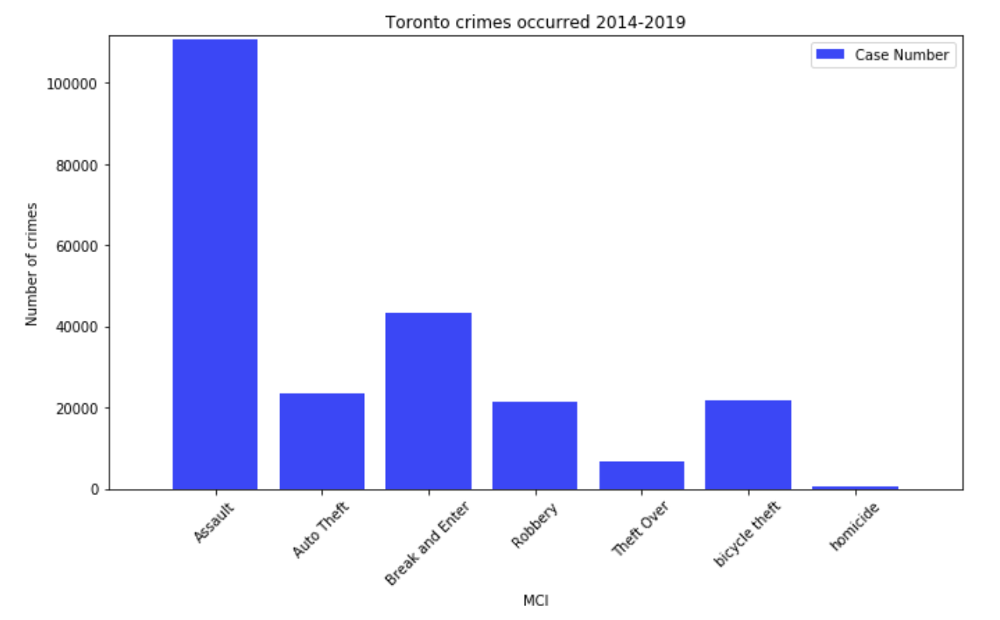
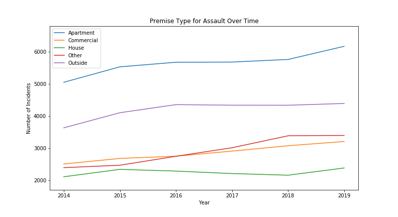

# Project-01: Toronto Crime Analysis

## Team
Our team consists of:
- Feng Wang
- Olive Sun
- Jaehong Kwon
- XiongFei (Frank) Shi
- Neha Nayeem

## Background

This project aims to analyze and visualize crime cases in Toronto from 2014-2019. Correlations between crime and various metrics like time and seasons, premises and locations, and economy were looked at using open datasets (see 'Resources' below). 

* The script was coded using Jupyter notebook. The libraries used were Pandas, Matplotlib, NumPy, SciPy, calendar. Gmaps and Google Places APIs was used to create heatmaps and find police stations.

* Our project folder contains:

    * A Jupyter notebook named `Project-1.ipynb` to run the analysis. The notebook also contains observations and insights that were made looking at the data (this is also below under *Questions and Observations*).

    * A `Data` folder that contains the CSV files downloaded in from open data websites (under `Notes and Resources` below)

    * A `Data Output` folder that contains our output files after the initial data cleaning

    * An `Image-Output` folder that contains the various visualizations created by the analysis
    
## Notes and Resources

* A `config.py` file will be required for the notebook to run properly. This should contain the Google API key needed to make the API calls. 

* The following datasets were used:
    - Crime data from Toronto Police Open Data: https://data.torontopolice.on.ca/pages/open-data
    - Monthly GDP growth rates of Canada: https://www150.statcan.gc.ca/
    
* After data cleaning, we noticed that the total Major Crime Indicator (MCI) dataset listed five different kinds of crimes: assault, auto theft, break and enter, robbery and theft over. However, it did not contain bicycle theft and homicide data, although this was available separately. To get all seven types of crimes, we needed to add data from bicycle theft and homicide files.  

* In addition, the format of bicycle theft and homicide data were different to MCI data, for e.g. they were missing some columns like “occurrence month” and the date was in a different format. In order to get the final dataset, we needed to rename the columns of bicycle theft and homicide to make them consistent with the MCI file.

* There are two types of dates in the data sets, reported date and occurrence date. The reported dates are sometimes delayed with respect to the occurrence so we analyzed data based on occurrence dates between 2014 and 2019 and not the reported date. 

* We are using Canada GDP growth rates to represent Toronto as there is no data available for Toronto.

## Questions and Observations
The following questions were asked of the data:

#### 1 a). What are the most common / least common crimes in Toronto?
 - From 2014 to 2019, Assault is by far the most common crime with occurrences over 110,000, it accounts for 49% of total crimes. It is more than double the number of incidents for the second most common crime Break and Enter.

 - Homicide is the least common crime over the 6 year period and only accounts for less than 0.5% of the total crime.

 
 
#### 1 b). What are the total number of crimes in 2014-2019 and are there any trends?
 
 - The crime occurrence in Toronto is increasing from 2014 to 2019.
 

#### 2. What time of the year the frequency of crime is highest? 
 - **Correlation of crime with different seasons:**
    - Based on the 6-year average, the total number of crimes peak in the month of July (3606 cases) while the month of February is lowest (2,484 cases). There are more crimes in summer season then in winter season.

    - Individual type of crime have different patterns. However, Feburary is the lowest point across all type of crimes. 

    - For Assault, the peak is in summer season (Jun, Jul, Aug). Break and Enter, Auto Theft, Robbery have peaks in October.
      
      

- **Correlation of crime with time of the day:**
    - Lowest crime occurred in a day is early in the morning (around 6 am)

    - "Assault" and "Break and Enter" crime occurred most at mid-night while "Auto Theft" is at peak around 10pm and "Robbery" at 9pm.

    - At noon, we see a sudden spike for "Assault", "Break n Enter", "Auto Theft" 

       
       

#### 3. Crime by Neighbourhood
 - **Which neighborhoods experience the highest and lowest crime rates in Toronto?**
    - After analysing the data, we see the top 10 most dangerous neighbourhoods in the dataframe below:
    

    - We also see the top 10 most safe neighbourhoods in the dataframe below:
       

    - A heatmap was created with the above neighbourhoods as symbol markers, to get an idea of their locations:
    
     * 60% of the top 10 most dangerous neighbours appear to be in the Toronto downtown area, with the rest spread quite far away from each other.

     * The Yonge-St.Clair neighbourhood  is considered a safe neighbourhood with less crimes - this is interesting given its proximity to downtown Toronto where crime cases are high.

     * There appear to be a marginally higher number of safer neighbourhoods in the west end of Toronto.
        
- **How close were police stations to where the crime occurred?**
    - Google Places API was called to find police stations within 5000m of the top 10 neighbourhoods and these were added as marker symbols on the heatmap:
        

    - It appears that Toronto Police 52 Division is the nearest police station for 6 of the top 10 neighbourhoods with most crimes. This shows that the neighbourhoods are close to one another and also calls to question whether this particular division might be overwhelmed with crime incidents. It would be interesting to dive deeper and find out whether there is a correlation between crime rates and government funding for each police divisions.

- **Where in Toronto are Auto Theft, Break and Enter and Robbery likely to occur?**
  -  Break and Enter and Robbery’s scatter pattern are consistent with the Toronto Crime Heat Map, they are most likely to occur in the most dangerous Downtown area. Auto Theft does not follow the same pattern and appeared to be scattered all over the city.
     
         
     

#### 4. In what kinds of properties do the following crimes occur? (house, commercial, apartment, etc)
- **Break-and-enter**
     
      

    - For Break and Enter (B&E), in 2014, there are almost twice the incidents happening in houses compared with Commercial or Apartment premises.
    
    - However, House B&Es are decreasing over time while commercial B&Es are increasing. At the end of 2019, there are almost 1000 more B&E cases for commercial than houses
    
    - There is a decrease in the number of incidents for apartments from 2015 to 2016 and this then started increasing at a steady rate since 2016, finally become more rampant than house B&Es.
    
    - Even though House B&Es are decreasing over the years, the pie chart shows that it still has the highest total number of incidents.

- **Robbery**
     
       

    - Incidents in apartment and houses are pretty steady over the six years.
    
    - Majority of robberies happen outside and in commercial areas
    
    - Robberies happening outside started to decrease from 2017, however, it is still twice as much incidents as the second popular premise-commerical by the end of 2019
    
    - Robbery is three times more likely to happen in apartments than in houses

- **Assault**
        

    - Assaults in all premises are generally in an increasing trend
    
    - Assaults in apartments are most likely and is increasing at the highest rate
    
    - Assaults are almost three times more likely to happen in apartments than in houses

#### 5. Is crime decreasing/increasing over the years?
- **Correlation of crime with current economy**
    - The number of crimes occurred in Toronto has weak correlation with GDP growth rate.
    - The GDP has stable growth rate.
      

